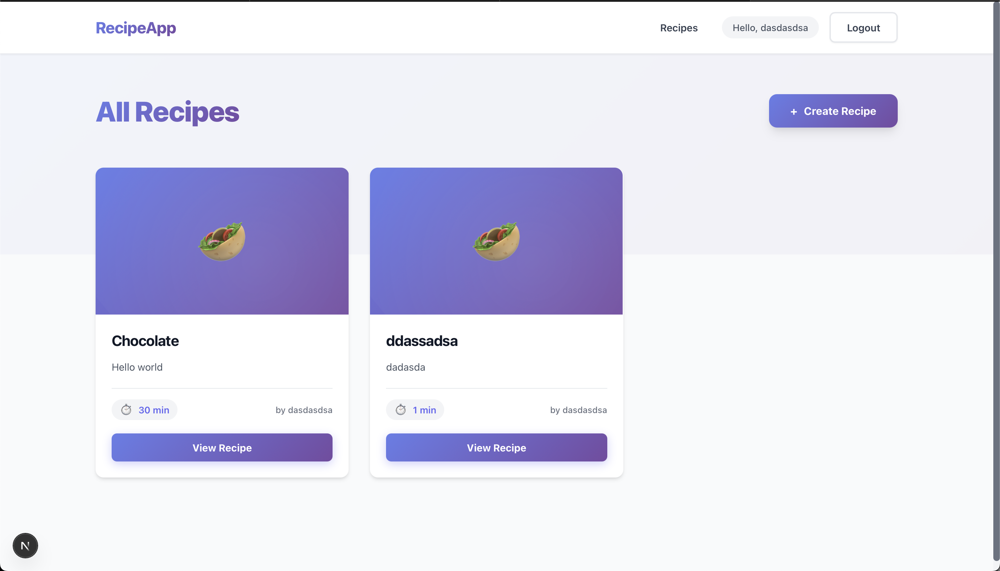
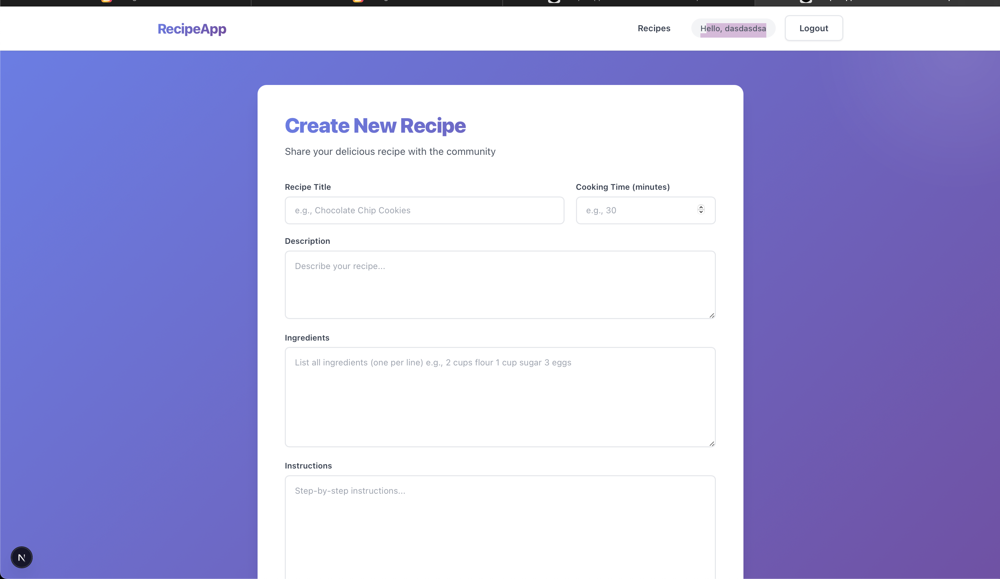
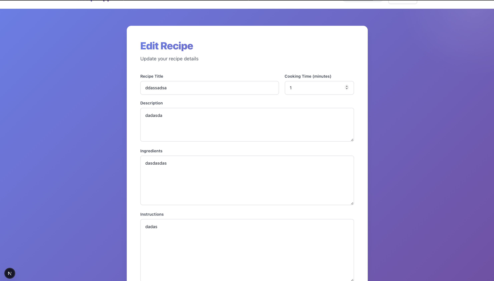

# Recipe App

Full-stack Next.js practical project built for the Web Programming assignment. The app uses Prisma with SQLite, credential-based authentication with NextAuth, and full CRUD for recipes.

## Project Theme

This project implements a recipe management application where users can:

- create an account
- log in and log out
- create, view, edit, and delete recipes
- open a details page for each recipe
- keep recipes private or publish them to the community

## Main Features

- Authentication with registration, login, logout, and session handling
- Automatic login right after successful registration
- Protected create and edit routes
- Ownership rules: users can edit and delete only their own recipes
- Recipe visibility:
    - `My Recipes` shows only the signed-in user's recipes
    - `Community` shows public recipes only
    - new recipes are private by default
- Full CRUD with Prisma and SQLite
- Responsive UI built with CSS Modules

## Tech Stack

- Next.js 16.2.4
- React 19
- TypeScript
- Prisma ORM
- SQLite
- NextAuth v5 beta
- bcryptjs
- CSS Modules

## Route Overview

- `/` - home page
- `/register` - user registration
- `/login` - user login
- `/recipes` - private list of the current user's recipes
- `/community` - public recipe feed
- `/recipes/new` - create recipe
- `/recipes/[id]` - recipe details
- `/recipes/[id]/edit` - edit recipe
- `/api/register` - registration API
- `/api/recipes` - list/create recipes API
- `/api/recipes/[id]` - details/update/delete recipe API

## Authentication Flow

1. A user registers with name, email, and password.
2. The password is hashed with `bcryptjs`.
3. Duplicate emails are blocked.
4. After successful registration, the user is automatically signed in.
5. NextAuth stores the session using JWT strategy.
6. Logout redirects the user to `/login`.

## Recipe Rules

- Every recipe belongs to the user who created it.
- Only the owner can edit or delete a recipe.
- A recipe can be private or public.
- Private recipes are visible only to their owner.
- Public recipes appear in the community feed.

## Database Models

### User

- `id`
- `name`
- `email`
- `password`
- `createdAt`
- `updatedAt`

### Recipe

- `id`
- `title`
- `description`
- `ingredients`
- `instructions`
- `cookingTime`
- `isPublic`
- `createdAt`
- `updatedAt`
- `userId`

## Project Structure

```text
app/
  api/
    auth/[...nextauth]/
    recipes/
    register/
  community/
  login/
  recipes/
    [id]/
    new/
  register/
components/
  Button/
  Card/
  DeleteButton/
  Input/
  Navbar/
  RecipeCard/
  Textarea/
lib/
  auth.ts
  prisma.ts
prisma/
  migrations/
  schema.prisma
types/
middleware.ts
```

## Getting Started

### Prerequisites

- Node.js 18+
- npm

### Installation

1. Install dependencies:

```bash
npm install
```

2. Create a `.env` file with:

```env
DATABASE_URL="file:/Users/zzeroootwooo/Desktop/work/NextVumPracticalProjectLeontiiLeonov/prisma/dev.db"
NEXTAUTH_SECRET="your-secret-key-change-this-in-production"
NEXTAUTH_URL="http://localhost:3000"
```

3. Run migrations:

```bash
npx prisma migrate dev
```

4. Start the app:

```bash
npm run dev
```

5. Open `http://localhost:3000`

## Development Commands

```bash
npm run dev
npm run build
npm run lint
npx tsc --noEmit
npx prisma studio
```

## Prisma Migrations

Current migrations in the project:

- `20260502122828_init`
- `20260504144523_add_recipe_visibility`

## Validation and Error Handling

The app handles:

- empty required fields
- invalid email format
- weak passwords during registration
- duplicate email registration
- invalid login credentials
- unauthorized create/edit/delete attempts
- missing recipes
- invalid cooking time values

## Screenshots

Currently included in `screenshots/`:

- Home page


- Register page


- Login page


- Recipes list page



- Create recipe page



- Edit recipe page



## Assignment Notes

This repository includes:

- working source code
- Prisma schema
- Prisma migrations
- README
- development log in `DEVELOPMENT_LOG.md`

## License

Created for educational purposes as a Web Programming practical assignment.
